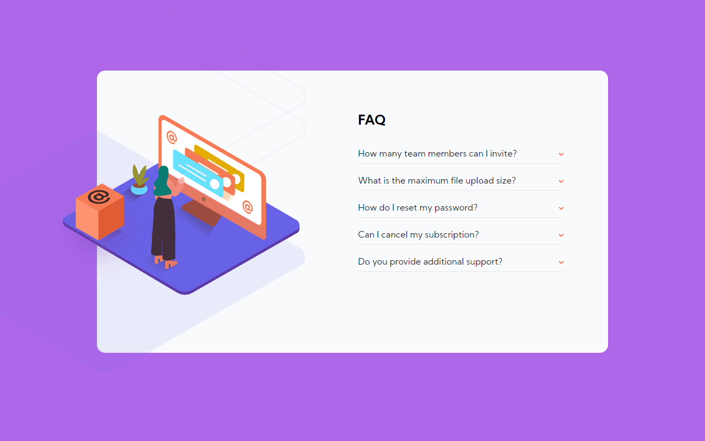

# Frontend Mentor - FAQ accordion card solution

This is a solution to the [FAQ accordion card challenge on Frontend Mentor](https://www.frontendmentor.io/challenges/faq-accordion-card-XlyjD0Oam). Frontend Mentor challenges help you improve your coding skills by building realistic projects.

## Table of contents

- [Overview](#overview)
  - [The challenge](#the-challenge)
  - [Screenshot](#screenshot)
  - [Links](#links)
- [My process](#my-process)
  - [Built with](#built-with)
  - [What I learned](#what-i-learned)
  - [Continued development](#continued-development)
  - [Useful resources](#useful-resources)
- [Author](#author)
- [Acknowledgments](#acknowledgments)

## Overview

### The challenge

Users should be able to:

- View the optimal layout for the component depending on their device's screen size
- See hover states for all interactive elements on the page
- Hide/Show the answer to a question when the question is clicked

### Screenshot

                This is a desktop View.
                 

                 This is for mobile view taken on a Pixel 2.
                 
  

   
  

### Links

- Solution URL: [Add solution URL here](https://your-solution-url.com)
- Live Site URL: `https://AlbertSigsbert.github.io/FAQ-accordion/`

## My process

### Built with

- Semantic HTML5 markup
- Vanilla CSS
- CSS Grid
- Sass
- Vanilla

**Note: These are just examples. Delete this note and replace the list above with your own choices**

### What I learned

Using CSS transform:translate(X,Y) to position images easily.

JS event delegation and Traversing the DOM.

### Continued development

To improve JS event delegation and traversing skills

### Useful resources

- StackOverflow (Some helpful guides and tips)

## Author

- Website -`https://AlbertSigsbert.github.io/Portfolio/`
- Frontend Mentor -https://www.frontendmentor.io/profile/AlbertSigsbert
- Twitter - https://twitter.com/albert_sigsbert
